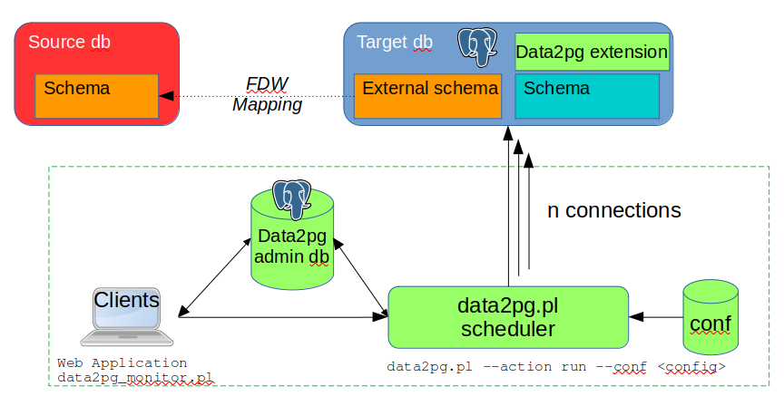
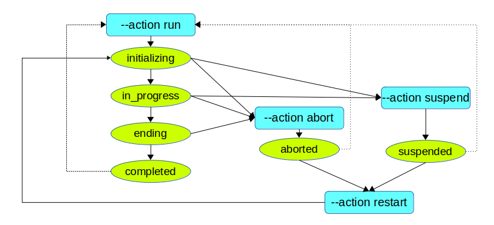

Data2Pg
=======

Data2Pg is a tools framework that helps migrating non-PostgreSQL database contents into PostgreSQL.

Version: 0.5

# License

Data2Pg is distributed under the GNU General Public License.

# Objectives

The main goal of Data2Pg is to help in database migration projects moving data from a non-PostgreSQL RDBMS into PostgreSQL. Three functions are available:

 * discover source database contents before migrating them into PostgreSQL ;
 * copy database contents from various databases into PostgreSQL ;
 * compare non PostgreSQL databases and their equivalent Postgres one to help non regression test campaigns.

These 3 functions use the same infrastructure. The source database is directly accessed from PostgreSQL using a Foreign Data Wrapper.

# Architecture

The Data2Pg framework has several components:

  * an extension installed into the target Postgres database
  * a dedicated data2pg database that is generaly installed in a central point of the migration project
  * a scheduler that performs the requested actions
  * a monitor tool that reports the migration progress in real time and display detailed information about past migrations
  * a web client that may be used to ease the scheduler run and the batches monitoring.



# Concepts

A few concepts must be defined:

  * Database: a target PostgreSQL database to migrate
  * Migration: the global migration operation of a Database, feeded with data from a single source database located on a single foreign server and accessed by a single user mapping
  * Batch: a set of tables and sequences to process; a Migration may consist in several Batches
  * Batch Run: a scheduler launch to execute one Batch
  * Step: an elementary operation to process a table, a sequence, etc; it executes a single SQL function on the target Database into a single transaction
  * Working plan: the set of Steps that constitutes a Batch
  * Session: a scheduler connection on the target Database to execute Steps


# How to install Data2Pg

The Data2Pg installation can be splitted into 4 steps.

## Installing the software

As Data2Pg uses a Foreign Data Wrapper to access data located on the source database, a Foreign Data Wrapper extension needs to be installed into the target PostgreSQL instance and database. It depends on the source database type. Refer to its documentation for its installation.

To install both `data2pg` and `data2pg_admin` extensions, go to the extension directory and install files.

```sh
cd ext/
make PG_CONFIG=<path/to/pg_config> install
```

The scheduler and the monitor clients are written in perl and use the DBI and DBD::Postgres modules. These components may need to be installed on your machine.

## Creating the administration database

Data2Pg needs its own adminstration database. This database may be created into the same PostgreSQL instance as a database to populate. Its size and SQL load are very low. It will be dropped once the migration project will be completed.

This database contains a `target_database` table that describes all PostgreSQL databases concerned by the migration project. This table can be fed by the Web client. It can also be populated at creation time by loading a `target_database.dat` file. In this case, the provided template file must be adjusted. The first line is a header and must be left as is. Each subsequent lines describes a target database. It contains the following fields:

   * tdb_id : a Data2Pg target database identifier (this name will be used for Data2Pg operations)
   * tdb_host : the IP address to reach the PostgreSQL target database
   * tdb_port : the IP port to reach the PostgreSQL target database
   * tdb_dbname : the PostgreSQL database name
   * tdb_description : a textual description of the database (optional)
   * tdb_locked : a flag to protect the database against unattended data copy ; set it to FALSE to run batches of type COPY.

The administration database can be created using the supplied `data2pg_init_db.sh` shell script. Before running it, adjust the environment variables defined at the beginning of the script. Then type:

```sh
./data2pg_init_db.sh
```

The script:

   * creates a database named `data2pg`;
   * creates a role named `data2pg`, if it does not exist yet;
   * creates the `data2pg_admin` extension inside the `data2pg` database;
   * loads the file that populates the `target_database` table.

## Installing the Web client

In order to install the optional Web client, the `data2pg/www` subdirectory must be accessible for a web server with php activated.

Then the `data2pg/www/conf/config.inc.php` must be created using the `config.inc.php-dist` template.


## Creating the data2pg extension

On each target database, the `data2pg` extension must be created using the supplied `data2pg_init_extension.sh` shell script. Before running it, adjust the environment variables defined at the beginning of the script. Then type:

```sh
./data2pg_init_extension.sh
```

The script:

   * creates a role named `data2pg`, if it does not already exist in the instance;
   * creates the `data2pg` extension inside the target database;
   * loads custom components that may be needed for specific migration steps, by executing the `data2pg_addons.sql` SQL script file.

# How to configure migrations

Before configuring migrations, the target database application schemas must be fully created: tables, sequences, indexes, constraints, etc.

A migration is configured by using a functions set provided by the `data2pg` extension. It typically chains several main steps:

  * create a migration object, defining the source database and the way to reach it
  * register all tables and sequences to process, defining their migration specificities, if any
  * create batches
  * assign steps to the batches: table copy, sequence copy, etc
  * complete the migration configuration, building the batch working plans

Here are details about the migrations configuration API.

## Migrations management

The `create_migration()` function registers a new migration and creates:

  * the FDW extension if it does not already exist
  * the Foreign Server, named data2pg_<migration_name>_server
  * and the User Mapping to use to reach the source database

The input parameters are:

  * p_migration             : (TEXT) The migration name
  * p_sourceDbms            : (TEXT) The source DBMS name (must comply the migration.mgr_source_dbms CHECK constraint)
  * p_extension             : (TEXT) The FDW extension name
  * p_serverOptions         : (TEXT) The options to add when creating the FDW server
  * p_userMappingOptions    : (TEXT) The FDW user_mapping to use to reach the source database
  * p_userHasPrivileges     : (BOOLEAN) A boolean indicating whether the user has DBA priviledges (Oracle specific) def=FALSE 
  * p_importSchemaOptions   : (TEXT) The options to add to the IMPORT SCHEMA statement for foreign tables creation

The function returns the number of created migration, i.e. 1.

The `drop_migration()` function drops an existing migration and all related objects (registered tables, batches, steps, etc).

The input parameter is:

  * p_migration             : (TEXT) The migration name

The function returns the number of dropped foreign tables.

The `complete_migration_configuration()` function is the final function in migration's configuration. It checks that all registered and assigned data are consistent and builds the chaining constraints between steps.

The input parameter is:

  * p_migration             : (TEXT) The migration name

## Objects registration

The `register_tables()` function links a set of tables from a single schema to a migration. It creates a foreign table for each registered table. The tables selection is defined by two regexp filters, one to specify the tables to include, and one to specify the tables to exclude.

The input parameters are:

  * p_migration             : (TEXT) The migration linked to the tables
  * p_schema                : (TEXT) The schema which tables have to be registered into the migration
  * p_tablesToInclude       : (TEXT) The regexp defining the tables to register for the schema
  * p_tablesToExclude       : (TEXT) The regexp defining the tables to exclude (NULL to exclude no table)
  * p_sourceSchema          : (TEXT) The schema or user name in the source database (equals p_schema if NULL, which is the default)
  * p_sourceTableNamesFnct  : (TEXT) A function name to use to compute the source table names using the target table names, NULL means both names are equals. May be 'upper', 'lower' or any schema qualified custom function
  * p_sourceTableStatLoc    : (TEXT) The data2pg table that contains statistics about these target tables (source_table_stat by default, built by the *create_migration()* function)
  * p_createForeignTable    : (BOOLEAN) A boolean indicating whether the FOREIGN TABLE have to be created (TRUE by default; if FALSE, an external operation must create them before launching a scheduler run)
  * p_ForeignTableOptions   : (TEXT) A specific directive to apply to the created foreign tables (none by default; it will be appended as is to an ALTER FOREIGN TABLE statement; it may be "OTPIONS (<key> 'value', ...)" for options at table level, or "ALTER COLUMN <column> (ADD OPTIONS <key> 'value', ...), ...' for column level options)
  * p_separateCreateIndex   : (BOOLEAN) A boolean indicating whether the indexes of these tables have to be created by separate steps to speed-up index rebuild for large tables with a lof of indexes (FALSE by default)
  * p_sortByPKey            : (BOOLEAN) A boolean indicating whether the source data must be sorted on PKey at migration time (FALSE by default; they are sorted anyway if a clustered index exists)

The function returns the number of effectively assigned tables.

The `register_table()` function links a single table to a migration. It is just a wrapper over the *register_tables()* function.

The input parameters are:

  * p_migration             : (TEXT) The migration linked to the tables
  * p_schema                : (TEXT) The schema which tables have to be registered into the migration
  * p_table                 : (TEXT) The table name to register
  * p_sourceSchema          : (TEXT) The schema or user name in the source database (equals p_schema if NULL, which is the default)
  * p_sourceTableNamesFnct  : (TEXT) A function name to use to compute the source table name using the target table name, NULL means both names are equals. May be 'upper', 'lower' or any schema qualified custom function
  * p_sourceTableStatLoc    : (TEXT) The data2pg table that contains statistics about these target tables (source_table_stat by default, built by the *create_migration()* function)
  * p_createForeignTable    : (BOOLEAN) A boolean indicating whether the FOREIGN TABLE have to be created (TRUE by default; if FALSE, an external operation must create them before launching a scheduler run)
  * p_ForeignTableOptions   : (TEXT) A specific directive to apply to the created foreign tables (none by default; it will be appended as is to an ALTER FOREIGN TABLE statement; it may be "OTPIONS (<key> 'value', ...)" for options at table level, or "ALTER COLUMN <column> (ADD OPTIONS <key> 'value', ...), ...' for column level options)
  * p_separateCreateIndex   : (BOOLEAN) A boolean indicating whether the indexes of these tables have to be created by separate steps to speed-up index rebuild for large tables with a lof of indexes (FALSE by default)
  * p_sortByPKey            : (BOOLEAN) A boolean indicating whether the source data must be sorted on PKey at migration time (FALSE by default; they are sorted anyway if a clustered index exists)

The function returns the number of effectively assigned tables, I.e. 1.

The `register_column_transform_rule()` functions defines a column change from the source table to the destination table. It allows to manage columns with different names, with different types and or with specific computation rule. The target column is defined with the schema, table and column name.

The input parameters are:

  * p_schema                : (TEXT) The schema name of the related table
  * p_table                 : (TEXT) The table name
  * p_column                : (TEXT) The column name as it would appear in the INSERT INTO clause of the copy processing
  * p_expression            : (TEXT) The expression as it will appear in the SELECT clause of the copy processing. It may be another column name if the column is renamed or an expression if the column content requires a transformation rule.

The function returns the number of registered column transformations, i.e. 1.

If several transformation rules are applied for the same column, only the last one defines the real transformation that will be applied.

The `register_column_comparison_rule()` functions defines a specific rule to use when comparing a column between the source and the target databases. It allows to either simply mask the column for the COMPARE operation, or to compare the result of an expression on both source and target tables. The expressions on the source and the target databases may be different.

The input parameters are:

  * p_schema                : (TEXT) The schema name of the target table
  * p_table                 : (TEXT) The target table name
  * p_column                : (TEXT) The target column name
  * p_sourceExpression      : (TEXT) The expression to use on the source table for the comparison operation; a NULL value, which is the default, simply masks the column
  * p_targetExpression      : (TEXT) The expression to use on the target table for the comparison operation; equals p_sourceExpression when NULL, which is the default

The function returns the number of registered column transformations, i.e. 1.

If several comparison rules are applied for the same column, only the last one defines the real way to compare the column.

The `register_table_part()` function defines a table's subset that will be processed by its own migration step. The related table must have been already registered. A table part step includes 1 or 2 of the usual 3 elementary actions of a table processing:

  * pre-processing: dropping constraints and indexes
  * data processing
  * post-processing: creating constraints and indexes, get statistics on the table

Using table parts allows to parallelize a single table copy, and/or anticipate the copy of a table subset.

The input parameters are:

  * p_schema                : (TEXT) The schema name of the related table
  * p_table                 : (TEXT) The table name
  * p_partId                : (TEXT) The part id, which is unique for a table
  * p_condition             : (TEXT) The condition that will filter the rows to copy at migration time. NULL if no row to copy
  * p_isFirstPart           : (BOOLEAN) A boolean indicating that the part is the first one for the table (FALSE by default; if TRUE, the pre-processing action is performed)
  * p_isLastPart            : (BOOLEAN) A boolean indicating that the part is the last one for the table (FALSE by default; if TRUE, the post-processing action is performed)

The function returns the number of registered table parts, i.e. 1.

The `register_sequences()` function links a set of sequences from a single schema to a migration. The sequences selection is defined by two regexp filters, one to specify the sequences to include, and one to specify the sequences to exclude.

The input parameters are:

  * p_migration             : (TEXT) The migration linked to the sequences
  * p_schema                : (TEXT) The schema which sequences have to be registered into the migration
  * p_sequencesToInclude    : (TEXT) The regexp defining the sequences to register for the schema
  * p_sequencesToExclude    : (TEXT) The regexp defining the sequences to exclude (NULL to exclude no sequence)
  * p_sourceSchema          : (TEXT) The schema or user name in the source database (equals p_schema if NULL, which is the default)
  * p_sourceSequenceNamesFnct : (TEXT) A function name to use to compute the source sequence names using the target sequence names, NULL means both names are equals. May be 'upper', 'lower' or any schema qualified custom function

The function returns the number of effectively registered sequences.

The `register_sequence()` function links a single sequence to a migration. It is just a wrapper over the *register_sequences()* function.

The input parameters are:

  * p_migration             : (TEXT) The migration linked to the sequence
  * p_schema                : (TEXT) The schema holding the sequence to registered
  * p_sequence              : (TEXT) The sequence name to register
  * p_sourceSchema          : (TEXT) The schema or user name in the source database (equals p_schema if NULL, which is the default)
  * p_sourceSequenceNamesFnct : (TEXT) A function name to use to compute the source sequence name using the target sequence name, NULL means both names are equals. May be 'upper', 'lower' or any schema qualified custom function

The function returns the number of effectively registered sequences, I.e. 1.

## Batches management

The `create_batch()` function registers a new batch for an existing migration.

The input parameters are:

  * p_batchName             : (TEXT) The batch name
  * p_migration             : (TEXT) The migration name
  * p_batchType             : (TEXT) The Batch type (either 'COPY', 'COMPARE' or 'DISCOVER')
  * p_withInitStep          : (BOOLEAN) A boolean indicating whether an INIT step must be added to the batch working plan
  * p_withEndStep           : (BOOLEAN) A boolean indicating whether an END step must be added to the batch working plan

The function returns the number of created batch, i.e. 1.

INIT and END steps perform various actions depending on the batch type. For batches of type COPY, the INIT and END steps check the data structure consistency; the INIT step truncates all target tables.

The `drop_batch()` function removes all components linked to a given batch.

The input parameter is:

  * p_batchName             : (TEXT) The batch name

The function returns the number of removed steps.

## Steps assignment management

The `assign_tables_to_batch()` function assigns a set of tables of a single schema to a batch. Two regexp filter tables already registered to a migration to include and exclude to the batch.

The input parameters are:

  * p_batchName             : (TEXT) The batch name
  * p_schema                : (TEXT) The schema which tables have to be assigned to the batch
  * p_tablesToInclude       : (TEXT) The regexp defining the registered tables to assign for the schema
  * p_tablesToExclude       : (TEXT) The regexp defining the registered tables to exclude (NULL to exclude no table)

The function returns the number of effectively assigned tables.

The `assign_table_to_batch()` function assigns a single table to a batch. It is a simple wrapper over the *assign_tables_to_batch()* function.

The input parameters are:

  * p_batchName             : (TEXT) The batch name
  * p_schema                : (TEXT) The schema holding the table to assign to the batch
  * p_table                 : (TEXT) The table to assign

The function returns the number of effectively assigned tables, i.e. 1.

The `assign_table_part_to_batch()` function assigns a table's part to a batch.

The input parameters are:

  * p_batchName             : (TEXT) The batch name
  * p_schema                : (TEXT) The schema holding the table
  * p_table                 : (TEXT) The table name
  * p_partId                : (TEXT) The part id to assign to the batch

The function returns the number of effectively assigned table parts, i.e. 1.

The `assign_index_to_batch()` function assigns an index re-creation to a batch. At table registration time, the flag *p_separateCreateIndex* must have been set to TRUE.

The input parameters are:

  * p_batchName             : (TEXT) The batch name
  * p_schema                : (TEXT) The schema holding the table
  * p_table                 : (TEXT) The table name
  * p_object                : (TEXT) The index or constraint to assign

The function returns the number of effectively assigned indexes, i.e. 1.

The `assign_tables_checks_to_batch()` function assigns a set of table checks of a single schema to a batch. Two regexps filter tables already registered to a migration to include and exclude to the batch.

The input parameters are:

  * p_batchName             : (TEXT) The batch name
  * p_schema                : (TEXT) The schema holding the tables
  * p_tablesToInclude       : (TEXT) The regexp defining the registered tables which check have to be assigned for the schema
  * p_tablesToExclude       : (TEXT) The regexp defining the tables to exclude (NULL to exclude no table)

The function returns the number of effectively assigned table checks.

The `assign_table_checks_to_batch()` function assigns checks for a single table to a batch. It is a simple wrapper over the *assign_tables_checks_to_batch()* function.

The input parameters are:

  * p_batchName             : (TEXT) The batch name
  * p_schema                : (TEXT) The schema holding the table
  * p_table                 : (TEXT) The table which check has to be assigned to the batch

The function returns the number of effectively assigned tables, i.e. 1.

The `assign_sequences_to_batch()` function assigns a set of sequences of a single schema to a batch. Two regexps filter already registered sequences to a migration to include and exclude to the batch.

The input parameters are:

  * p_batchName             : (TEXT) The batch name
  * p_schema                : (TEXT) The schema holding the sequences
  * p_sequencesToInclude    : (TEXT) The regexp defining the sequences to assign for the schema
  * p_sequencesToExclude    : (TEXT) The regexp defining the sequences to exclude (NULL to exclude no sequence)

The function returns the number of effectively assigned sequences.

The `assign_sequence_to_batch()` function assigns a single sequence to a batch. It is a simple wrapper over the *assign_sequences_to_batch()* function.

The input parameters are:

  * p_batchName             : (TEXT) The batch name
  * p_schema                : (TEXT) The schema holding the sequence to assign
  * p_sequence              : (TEXT) The sequence name to assign

The function returns the number of effectively assigned sequences, i.e. 1.

The `assign_fkey_checks_to_batch()` function assigns checks on one or all foreign keys of a table to a batch. By default, foreign keys are not checked by the migration process, as the integrity is supposed to be already ensured on the source database. But if a new foreign key has been added on the target database or if the source database may have been updated during the migration proces, it is important to add FK checks.

The input parameters are:

  * p_batchName             : (TEXT) The batch name
  * p_schema                : (TEXT) The schema holding the table with fkeys to check
  * p_table                 : (TEXT) The table name with fkeys to check
  * p_fkey                  : (TEXT) The Foreign key to check, NULL by default, meaning that all fkeys of the table have to be checked

The function returns the number of effectively assigned fkey check steps.

The `assign_custom_step_to_batch()` function assigns a step that will call a custom function. It is intended to excute any specific processing for a component to migrate. This function must already exist into the schema holding the data2pg extension. If the custom step needs to have parent steps, these relationship must be set using the *add_step_parent()* function.

The input parameters are:

  * p_batchName             : (TEXT) The batch name
  * p_stepName              : (TEXT) The step identifier, which must be unique within the batch
  * p_function              : (TEXT) The function to execute, whose API must conform the step execution functions
  * p_schema                : (TEXT) A schema name, if it is meaningful for the processing
  * p_object                : (TEXT) An object name (for instance a table name), if it is meaningful for the processing
  * p_subObject             : (TEXT) An sub_object name (for instance a part id), if it is meaningful for the processing
  * p_cost                  : (BIGINT) The cost to use at steps scheduling time. In general, high cost steps are executed first

The function returns the number of added steps, i.e. 1.

The `add_step_parent()` function creates an additional dependancy between 2 steps. At migration configuration completion time, dependancies between steps are automatically built. For instance, a table content check may only start after the related table copy completion. But it may be necessary to add custom dependancies. It is the user's responsability to set appropriate dependancy and avoid create loops between steps.

The input parameters are:

  * p_batchName             : (TEXT) The batch name
  * p_step                  : (TEXT) Step identifier
  * p_parent_step           : (TEXT) Parent step identifier

The function returns the number of effectively assigned parents, i.e. 1.

# How to start the scheduler

## Running a batch

There are two ways to start the scheduler: either using the web client interface or typing a shell command in a terminal.

The shell command syntax can be displayed with the --help option.

```sh
perl data2pg.pl --help

 Data2Pg - version 0.5
-----------------------
Data2Pg is a migration framework to load PostgreSQL databases (version 0.5)
Usage: data2pg.pl [--help] | [<options to log on the data2pg>] --action <action> [--conf <configuration_file>] [<other options>]]

  --host         : IP host of the data2pg administration database (default = PGHOST env. var.)
  --port         : IP port of the data2pg administration database (default = PGPORT env. var.)
  --action       : 'run' | 'restart' | 'suspend' | 'abort' | 'check' (no default)
  --conf         : configuration file (default = no configuration file)
  --verbose      : display additional information during the run
  --target       : target database identifier (mandatory) (*)
  --batch        : batch name for the run (mandatory, except for the 'check' action) (*)
  --step_options : JSON formatted list of options sent to each step (*)
  --sessions     : number of parallel sessions (default = 1) (*)
  --asc_sessions : number of sessions for which steps will be assigned in estimated cost ascending order (default = 0) (*)
  --comment      : comment describing the run (between single or double quotes to include spaces) (*)
  --ref_run      : id of a run used as a reference for the steps duration, instead of tables size (default = no reference run) (*)
  --run          : run_id supplied by external tools (should not be used for manual run start)
(*) the option may also be set in the configuration file. The command line parameters overide the configuration file content, if any
```

## The scheduler configuration file

Most parameters of the command line can be stored into a scheduler configuration file. In this file:

   * the '#' character starts a comment
   * a parameter if formated as : keyword = value

The following parameters are available:

```
# Identifier of the target database to migrate (mandatory)
TARGET_DATABASE    = <target_db>            # case sensitive, must match the target_database table content in the data2pg database

# Identifier of the batch (mandatory)
BATCH_NAME         = <batch_name>           # case sensitive, must match the migration configuration in the target database

# The maximum number of opened sessions on the target database. This defines the parallelism degree for the run.
MAX_SESSIONS       = <ss>                   # Default = 1

# Among the opened sessions, number of sessions for which the steps will be assigned in estimated cost ascending order.
ASC_SESSIONS       = <a>                    # Default = 0

# Run id whose step durations are used as step estimated costs instead of table size.
REFERENCE_RUN      = <rrr>                  # Default = no reference run

# Step options, in JSON format. They are forwarded to each elementary step of the batch to adjust their behaviour.
STEP_OPTIONS = {<json_formatted_options>}   # Default = no step option
```

## The step options

The migration configuration describes most technical details of the operations. But some options are also available at execution time. They depend on the batch type. When the scheduler is spawned in command line, these options can be set through either the parameters file read by the scheduler, if any, or directly in the --step_options parameter. In both cases, the set of options is formatted as a JSON structure.

For batches of type COPY, the following step options are available:

   * COPY_MAX_ROWS to limit the number of copied rows per table or table part, based on a fixed value;
   * COPY_PCT_ROWS to limit the number of copied rows per table or table part, based on a % of rows (computed from the source database statistics).

For batches of type DISCOVER, the following step options are available:

   * DISCOVER_MAX_ROWS to limit the number of analyzed rows per table, based on a fixed value;

For batches of type COMPARE, the following step options are available:

   * COMPARE_TRUNCATE_DIFF to truncate the content_diff table that collects the reported differences (boolean, 'false' by default);
   * COMPARE_MAX_DIFF to limit the number of differences per table reported by a batch of type COMPARE (no limit by default);
   * COMPARE_MAX_ROWS to limit the number of compared rows for a table.

Examples:

   * In a COPY batch parameter file, we could find a line:
```
STEP_OPTIONS = {"COPY_MAX_ROWS":10000}
```

   * In the scheduler spawn command line for a COMPARE batch, we could find the parameter:
```
 --step_options "{"COMPARE_TRUNCATE_DIFF":true, "COMPARE_MAX_DIFF":20}"
```

## Managing runs

Once a batch run is spawned by a `perl data2pg.pl --action run ...` command, it is possible to:

   * suspend its execution by issuing a `perl data2pg.pl --action suspend ...` command, i.e. let the steps in execution complete their task and then stop the run;
   * abort its execution by issuing a `perl data2pg.pl --action abort ...` command, i.e. immediately stop the batch run;
   * restart an aborted or suspended batch run by issuing a `perl data2pg.pl --action restart ...` command.

Note that a batch run that has unexpectedly aborted must be "officialy" aborted by a `perl data2pg.pl --action abort ...` command before any rerun or restart attempt.

When a batch run is restarted, a new run is spawned with a new attributed identifier. It uses the same working plan and consider all properly terminated steps of the previous run as already completed.

This chart shows the actions that can be performed on a batch run and its possible states.


## Run report

When a batch run is completed, the scheduler generates a synthetic report that looks like:

```
================================================================================
The run #6 is completed.
Target database           : pg_test_db
Batch                     : BATCH1 (type COPY)
Step options              : none
Run elapse time           : 00:00:00.638102
Number of processed steps : 44
Aggregated indicators
     COPIED_TABLES        : 16
     COPIED_ROWS          : 126011
     DROPPED_INDEXES      : 3
     RECREATED_INDEXES    : 3
     COPIED_SEQUENCES     : 7
     CHECKED_FKEYS        : 4
     CHECKED_TABLES       : 9
     COMPUTED_AGGREGATES  : 9
     UNEQUAL_AGGREGATES   : 0
     DO_NOTHING_OK        : 1
     FINAL_CHECKS_OK      : 1
The operation details are available in the data2pg administration database.
================================================================================
```
The reported indicators depend on the executed action types. Checking them is important because they may report troubles encountered in the batch run. For instance, UNEQUAL_AGGREGATES should always be 0, when present.

# How to get detailed results

For some batch types, additional results can be examined.

## Check steps of COPY batches

Table content checks record the computed aggregates like the number of rows into a `counter` table located into the *data2pg* extension schema, named `data2pg` by default. Its structure is:

   * cnt_schema             : The schema of the target table
   * cnt_table              : The target table name
   * cnt_database           : The examined database ('S' for Source or 'D' for Destination)
   * cnt_counter            : The counter name
   * cnt_value              : The counter value
   * cnt_timestamp          : The transaction timestamp of the table check

When several checks are performed for the same table, the last one overrides the previous results.

In order to ease the detection of discrepancies, a view is also available, named `counter_diff` and located into the *data2pg* extension schema. It only reports counters for which the values are different between both databases. Its structure is:

   * cnt_schema             : The schema of the target table
   * cnt_table              : The target table name
   * cnt_counter            : The counter name
   * cnt_source_value       : The counter value on the source database
   * cnt_dest_value         : The counter value on the destination database
   * cnt_source_ts          : The transaction timestamp of the source table check
   * cnt_dest_ts            : The transaction timestamp of the destination table check

## DISCOVER batches

Batches of type DISCOVER records their data into 3 tables located into the *data2pg* extension schema:

   * `discovery_table`      : contains 1 row per analysed table. It may be interested to be examined to get the the last analysis timestamp and the number of processed rows
   * `discovery_column`     : contains 1 row per analysed table column
   * `discovery_advice`     : contains generated pieces of advice. It is the most interesting table.

When several analysis are performed for the same table, the last one overrides the previous results.

The `discovery_advice` has the following structure:

   * dscv_schema            : The name of the schema holding the foreign table
   * dscv_table             : The analyzed foreign table name
   * dscv_column            : The column associated to the advice, or NULL for table level piece of advice
   * dscv_column_num        : The column rank in the pg_attribute table (i.e. its attnum)
   * dscv_advice_type       : The advice type (W = Warning, A = Advice)
   * dscv_advice_code       : A coded representation of the advice, like 'INTEGER' for the message "column ... could be an INTEGER"
   * dscv_advice_msg        : The textual representation of the piece of advice that can be infered from collected data

## COMPARE batches

For batches of type COMPARE, the steps record the detected differences between source and destination tables or sequences content into a `content_diff` table, located into the *data2pg* extension schema.  It has the following structure:

   * diff_timestamp          : The transaction timestamp of the relation comparison
   * diff_schema             : The name of the destination schema
   * diff_relation           : The name of the destination table or sequence used for the comparison
   * diff_rank               : A difference number for the relation
   * diff_database           : The database the rows comes from ('S' for Source or 'D' for Destination)
   * diff_key_cols           : The JSON representation of the table key, for rows that are different between both databases
   * diff_other_cols         : The JSON representation of the table columns not in key, for rows that are different between both databases or the sequence characteristics that are different between both databases

Several comparisons results can be registered for the same table. Diff data are accumulated into the *content_diff* table until the *COMPARE_TRUNCATE_DIFF* step option is set at COMPARE batch start.

# How to monitor runs

There are two ways to monitor in-progress or completed batch runs: either using the web client interface or running the data2pg_monitor client in a terminal.

The shell command syntax can be displayed with the --help option.

```sh
perl data2pg_monitor.pl --help
data2pg_monitor.pl belongs to the data2pg project (version 0.5).
It monitors data migrations towards PostgreSQL performed by the data2pg scheduler.

Usage:
  data2pg_monitor.pl [OPTION]...

Options:
  --host      IP host of the data2pg database (default = PGHOST env. var.)
  --port      IP port of the data2pg database (default = PGPORT env. var.)
  --lines     maximum number of lines to display (0 = default = no page size limit)
  --run       optional run id to examine. If no specific run is specified, display the latest runs
                registered into the data2pg database
  --delay     delay in seconds between 2 displays of details for a specific 'Initializing',
                'In_progress' or 'Ending' run (default = 5)
  --help      shows this help, then exit
  --version   outputs version information, then exit

Examples:
  data2pg_monitor.pl --host localhost --port 5432 --lines 40 --delay 10
              displays the list of the latest registered run, with no more than 40 generated lines
  data2pg_monitor.pl --host localhost --port 5432 --lines 40 --run 58 --delay 10
              monitors the run #58 and refresh the screen every 10 seconds
```

# How to test Data2Pg

Just for testing purpose, the proposed migration migrates a source PostgreSQL database into another PostgreSQL target database. The following steps must be executed:

  * Initialize the administration data2pg database by executing the `data2pg_init_db.sh` shell script (once the environment variables adjusted)
  ```
  bash data2pg_init_db.sh
  ```
  * Initialize both postgres source and target databases by executing the `test_pg/1-init.sh` shell script (once environment variables adjusted)
  ```
  bash test_pg/1-init.sh
  ```
  * Initialize the data2pg extension into the target database by executing the `data2pg_init_schema.sh` shell script (once environment variables adjusted)
  ```
  bash data2pg_init_extension.sh
  ```
  * Configure the `migration` by executing the `test_pg/3-configure.sh` shell script (once the environment variables adjusted)
  ```
  bash test_pg/3-configure.sh
  ```
  * Run the scheduler with commands like
  ```
  export PGHOST=localhost
  perl data2pg.pl --conf test_pg/batch0.conf --action run
  perl data2pg.pl --conf test_pg/batch1.conf --action run
  perl data2pg.pl --conf test_pg/batch_tables_check.conf --action run
  perl data2pg.pl --conf test_pg/batch_compare.conf --action run
  ```
  * Run the monitor with commands like
  ```
  export PGHOST=localhost
  perl data2pg_monitor.pl -r <run_id>
  ```

# How to uninstall Data2Pg

## Completing a database migration

Once a database is definitely migrated, its Data2Pg components can be dropped.

First log on the target database with a SUPERUSER role and execute the following SQL commandes:

```sql
SELECT drop_migration(<migration_name>);
DROP EXTENSION data2pg;
DROP SCHEMA data2pg CASCADE;
```

The `drop_migration()`function drops:

  * the *FOREIGN TABLEs* et the schemas that hold them;
  * the *USER MAPPING* and the *FOREIGN SERVER* associated to the migration.

However, it kepts the *FOREIGN DATA WRAPPER* object that may be used for other purposes. If it needs to be dropped, just type:

```sql
DROP EXTENSION <fdw_extension_name> CASCADE;
```

It the `data2pg` role is not used anymore by other databases of the instance it can be dropped also:

```sql
DROP ROLE data2pg;
```

## Completing the migration program

If all migration works are over, the Data2Pg administration database can be dropped. This can be done with the shell commands:

```shell
dropdb data2pg -h ... -p ... -U postgres
dropuser data2pg -h ... -p ... -U postgres
```

If the Web client has been installed, it can also be uninstalled from the web server.

# Contributing

Any contribution on the project is welcome.

