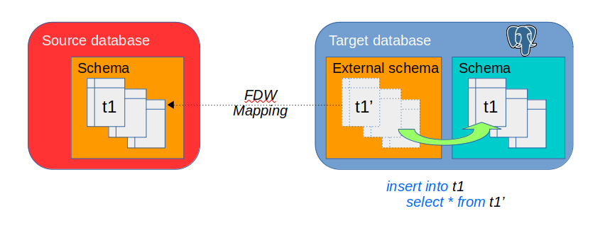

# Architecture and concepts

## Using Foreign Data Wrappers

*Foreign Data Wrappers* are libraries that can communicate with external data sources. They allow to create *Foreign Tables* into a PostgreSQL database that let users manipulate data from an external source using regular SQL statements. More details in the [PostgreSQL documentation](https://www.postgresql.org/docs/current/ddl-foreign-data.html)

Regarding table content migrations, once a foreign table is created into the target database to map a source table, copying the source table content into the target table can be efficiently performed with a simple `INSERT SELECT` statement.

## Data2Pg Architecture

The Data2Pg framework has several components:

  * an extension installed into the target Postgres database
  * a dedicated data2pg administration database that is generaly installed in a central point of the migration project
  * a scheduler that performs the requested actions
  * a monitor tool that reports the migration progress in real time and display detailed information about past migrations
  * a web client that may be used to ease the scheduler run and the batches monitoring.

## Connection to PostgreSQL databases

The administration database is owned by the `data2pg` role. This role is also used to log on this database.

The `data2pg` extension installed into each target databases is also owned by the `data2pg` role. But the scheduler logs on the target databases using either the `data2pg` role or another role having the `data2pg` priviledges.

Passwords are normally set in the .pgpass file.

The administration database contains a `target_database` table that identifies all databases that may be reached by the scheduler. This table contains optional columns to define non default roles to use, passwords not set in the .pgpass file or specific connection options.

## Data2Pg Concepts

A few concepts must be defined:

  * **Database**: a target PostgreSQL database to migrate
  * **Migration**: the global migration operation of a Database, feeded with data from a single source database located on a single foreign server and accessed by a single user mapping
  * **Batch**: a set of tables and sequences to process; a Migration may consist in several Batches
  * **Batch Run**: a scheduler launch to execute one Batch
  * **Step**: an elementary operation to process a table, a sequence, etc; it executes a single SQL function on the target Database into a single transaction
  * **Working plan**: the set of Steps that constitutes a Batch
  * **Session**: a scheduler connection on the target Database to execute Steps

