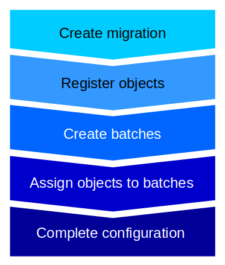

# How to configure migrations

Before configuring migrations, the target database application schemas must be fully created: tables, sequences, indexes, constraints, etc.

A migration is configured by using a functions set provided by the `data2pg` extension. It typically chains several main steps:

Here are details about the migrations configuration API.

## Migrations management

### create_migration()

The `create_migration()` function registers a new migration and creates:

  * the FDW extension if it does not already exist
  * the Foreign Server, named data2pg_<migration_name>_server
  * and the User Mapping to use to reach the source database

The input parameters are:

  * p_migration             : (TEXT) The migration name
  * p_sourceDbms            : (TEXT) The source DBMS name (must comply the migration.mgr_source_dbms CHECK constraint)
  * p_extension             : (TEXT) The FDW extension name
  * p_serverOptions         : (TEXT) The options to add when creating the FDW server
  * p_userMappingOptions    : (TEXT) The FDW user_mapping to use to reach the source database
  * p_userHasPrivileges     : (BOOLEAN) A boolean indicating whether the user has DBA priviledges (Oracle specific) def=FALSE 
  * p_importSchemaOptions   : (TEXT) The options to add to the IMPORT SCHEMA statement for foreign tables creation

The function returns the number of created migration, i.e. 1.

### drop_migration()

The `drop_migration()` function drops an existing migration and all related objects (registered tables, batches, steps, etc).

The input parameter is:

  * p_migration             : (TEXT) The migration name

The function returns the number of dropped foreign tables.

### complete_migration_configuration()

The `complete_migration_configuration()` function is the final function in migration's configuration. It checks that all registered and assigned data are consistent and builds the working plan, including chaining constraints between steps.

The input parameter is:

  * p_migration             : (TEXT) The migration name

The function returns the number of completed migration, i.e. 1 in most cases.

## Objects registration

### register_tables()

The `register_tables()` function links a set of tables from a single schema to a migration. It creates a foreign table for each registered table. The tables selection is defined by two regexp filters, one to specify the tables to include, and one to specify the tables to exclude.

The input parameters are:

  * p_migration             : (TEXT) The migration linked to the tables
  * p_schema                : (TEXT) The schema which tables have to be registered into the migration
  * p_tablesToInclude       : (TEXT) The regexp defining the tables to register for the schema  (all tables by default)
  * p_tablesToExclude       : (TEXT) The regexp defining the tables to exclude (NULL to exclude no table)
  * p_sourceSchema          : (TEXT) The schema or user name in the source database (equals p_schema if NULL, which is the default)
  * p_sourceTableNamesFnct  : (TEXT) A function name to use to compute the source table names using the target table names, NULL means both names are equals. May be 'upper', 'lower' or any schema qualified custom function
  * p_sourceTableStatLoc    : (TEXT) The data2pg table that contains statistics about these target tables (source_table_stat by default, built by the *create_migration()* function)
  * p_createForeignTable    : (BOOLEAN) A boolean indicating whether the FOREIGN TABLE have to be created (TRUE by default; if FALSE, an external operation must create them before launching a scheduler run)
  * p_ForeignTableOptions   : (TEXT) A specific directive to apply to the created foreign tables (none by default; it will be appended as is to an ALTER FOREIGN TABLE statement; it may be "OTPIONS (<key> 'value', ...)" for options at table level, or "ALTER COLUMN <column> (ADD OPTIONS <key> 'value', ...), ...' for column level options)
  * p_sortByClusterIdx      : (BOOLEAN) A boolean indicating whether the source data must be sorted on the cluster index, if any (TRUE by default)

The function returns the number of effectively assigned tables.

### register_table()

The `register_table()` function links a single table to a migration. It is just a wrapper over the *register_tables()* function.

The input parameters are:

  * p_migration             : (TEXT) The migration linked to the tables
  * p_schema                : (TEXT) The schema which tables have to be registered into the migration
  * p_table                 : (TEXT) The table name to register
  * p_sourceSchema          : (TEXT) The schema or user name in the source database (equals p_schema if NULL, which is the default)
  * p_sourceTableNamesFnct  : (TEXT) A function name to use to compute the source table name using the target table name, NULL means both names are equals. May be 'upper', 'lower' or any schema qualified custom function
  * p_sourceTableStatLoc    : (TEXT) The data2pg table that contains statistics about these target tables (source_table_stat by default, built by the *create_migration()* function)
  * p_createForeignTable    : (BOOLEAN) A boolean indicating whether the FOREIGN TABLE have to be created (TRUE by default; if FALSE, an external operation must create them before launching a scheduler run)
  * p_ForeignTableOptions   : (TEXT) A specific directive to apply to the created foreign tables (none by default; it will be appended as is to an ALTER FOREIGN TABLE statement; it may be "OTPIONS (<key> 'value', ...)" for options at table level, or "ALTER COLUMN <column> (ADD OPTIONS <key> 'value', ...), ...' for column level options)
  * p_sortByClusterIdx      : (BOOLEAN) A boolean indicating whether the source data must be sorted on the cluster index, if any (TRUE by default)

The function returns the number of effectively assigned tables, I.e. 1.

### register_column_transform_rule()

The `register_column_transform_rule()` functions defines a column change from the source table to the destination table. It allows to manage columns with different names, with different types and or with specific computation rule. The target column is defined with the schema, table and column name.

The input parameters are:

  * p_schema                : (TEXT) The schema name of the related table
  * p_table                 : (TEXT) The table name
  * p_column                : (TEXT) The column name as it would appear in the INSERT INTO clause of the copy processing
  * p_expression            : (TEXT) The expression as it will appear in the SELECT clause of the copy processing. It may be another column name if the column is renamed or an expression if the column content requires a transformation rule.

The function returns the number of registered column transformations, i.e. 1.

If several transformation rules are applied for the same column, only the last one defines the real transformation that will be applied.

### register_column_comparison_rule()

The `register_column_comparison_rule()` functions defines a specific rule to use when comparing a column between the source and the target databases. It allows to either simply mask the column for the COMPARE operation, or to compare the result of an expression on both source and target tables. The expressions on the source and the target databases may be different.

The input parameters are:

  * p_schema                : (TEXT) The schema name of the target table
  * p_table                 : (TEXT) The target table name
  * p_column                : (TEXT) The target column name
  * p_sourceExpression      : (TEXT) The expression to use on the source table for the comparison operation; a NULL value, which is the default, simply masks the column
  * p_targetExpression      : (TEXT) The expression to use on the target table for the comparison operation; equals p_sourceExpression when NULL, which is the default

The function returns the number of registered column transformations, i.e. 1.

If several comparison rules are applied for the same column, only the last one defines the real way to compare the column.

### register_table_part()

The `register_table_part()` function defines a table's subset that will be processed by its own migration step. The related table must have been already registered. A table part step includes 1 or 2 of the usual 3 elementary actions of a table processing:

  * pre-processing: dropping constraints and indexes
  * data processing
  * post-processing: creating constraints and indexes, get statistics on the table

Using table parts allows to parallelize a single table copy, and/or anticipate the copy of a table subset.

The input parameters are:

  * p_schema                : (TEXT) The schema name of the related table
  * p_table                 : (TEXT) The table name
  * p_partId                : (TEXT) The part id, which is unique for a table
  * p_condition             : (TEXT) The condition that will filter the rows to copy at migration time. NULL if no row to copy
  * p_isFirstPart           : (BOOLEAN) A boolean indicating that the part is the first one for the table (FALSE by default; if TRUE, the pre-processing action is performed)
  * p_isLastPart            : (BOOLEAN) A boolean indicating that the part is the last one for the table (FALSE by default; if TRUE, the post-processing action is performed)

The function returns the number of registered table parts, i.e. 1.

### register_sequences()

The `register_sequences()` function links a set of sequences from a single schema to a migration. The sequences selection is defined by two regexp filters, one to specify the sequences to include, and one to specify the sequences to exclude.

The input parameters are:

  * p_migration             : (TEXT) The migration linked to the sequences
  * p_schema                : (TEXT) The schema which sequences have to be registered into the migration
  * p_sequencesToInclude    : (TEXT) The regexp defining the sequences to register for the schema (all sequences by default)
  * p_sequencesToExclude    : (TEXT) The regexp defining the sequences to exclude (NULL to exclude no sequence)
  * p_sourceSchema          : (TEXT) The schema or user name in the source database (equals p_schema if NULL, which is the default)
  * p_sourceSequenceNamesFnct : (TEXT) A function name to use to compute the source sequence names using the target sequence names, NULL means both names are equals. May be 'upper', 'lower' or any schema qualified custom function

The function returns the number of effectively registered sequences.

### register_sequence()

The `register_sequence()` function links a single sequence to a migration. It is just a wrapper over the *register_sequences()* function.

The input parameters are:

  * p_migration             : (TEXT) The migration linked to the sequence
  * p_schema                : (TEXT) The schema holding the sequence to registered
  * p_sequence              : (TEXT) The sequence name to register
  * p_sourceSchema          : (TEXT) The schema or user name in the source database (equals p_schema if NULL, which is the default)
  * p_sourceSequenceNamesFnct : (TEXT) A function name to use to compute the source sequence name using the target sequence name, NULL means both names are equals. May be 'upper', 'lower' or any schema qualified custom function

The function returns the number of effectively registered sequences, I.e. 1.

## Batches management

### create_batch()

The `create_batch()` function registers a new batch for an existing migration.

The input parameters are:

  * p_batchName             : (TEXT) The batch name
  * p_migration             : (TEXT) The migration name
  * p_batchType             : (TEXT) The Batch type (either 'COPY', 'COMPARE' or 'DISCOVER')
  * p_withInitStep          : (BOOLEAN) A boolean indicating whether an INIT step must be added to the batch working plan
  * p_withEndStep           : (BOOLEAN) A boolean indicating whether an END step must be added to the batch working plan

The function returns the number of created batch, i.e. 1.

INIT and END steps perform various actions depending on the batch type. For batches of type COPY, the INIT and END steps check the data structure consistency; the INIT step truncates all target tables.

### drop_batch()

The `drop_batch()` function removes all components linked to a given batch.

The input parameter is:

  * p_batchName             : (TEXT) The batch name

The function returns the number of removed steps.

## Objects assignment management

### assign_tables_to_batch()

The `assign_tables_to_batch()` function assigns a set of tables of a single schema to a batch. Two regexp filter tables already registered to a migration to include and exclude to the batch.

The input parameters are:

  * p_batchName             : (TEXT) The batch name
  * p_schema                : (TEXT) The schema which tables have to be assigned to the batch
  * p_tablesToInclude       : (TEXT) The regexp defining the registered tables to assign for the schema (all tables by default)
  * p_tablesToExclude       : (TEXT) The regexp defining the registered tables to exclude (NULL to exclude no table)

The function returns the number of effectively assigned tables.

### assign_table_to_batch()

The `assign_table_to_batch()` function assigns a single table to a batch. It is a simple wrapper over the *assign_tables_to_batch()* function.

The input parameters are:

  * p_batchName             : (TEXT) The batch name
  * p_schema                : (TEXT) The schema holding the table to assign to the batch
  * p_table                 : (TEXT) The table to assign

The function returns the number of effectively assigned tables, i.e. 1.

### assign_table_parts_to_batch()

The `assign_table_parts_to_batch()` function assigns a set of tables parts of a given table to a batch.

The input parameters are:

  * p_batchName             : (TEXT) The batch name
  * p_schema                : (TEXT) The schema holding the table
  * p_table                 : (TEXT) The table name
  * p_partsToInclude        : (TEXT) The regexp defining the table part ids to assign for the table (all parts by default)
  * p_partsToExclude        : (TEXT) The regexp defining the table part ids to exclude (by default NULL, to exclude no part)

The function returns the number of effectively assigned table parts.

### assign_table_part_to_batch()

The `assign_table_part_to_batch()` function assigns a single table's part to a batch.

The input parameters are:

  * p_batchName             : (TEXT) The batch name
  * p_schema                : (TEXT) The schema holding the table
  * p_table                 : (TEXT) The table name
  * p_partId                : (TEXT) The part id to assign to the batch

The function returns the number of effectively assigned table parts, i.e. 1.

### assign_indexes_to_batch()

The `assign_indexes_to_batch()` function assigns a set of indexes re-creation to a batch. This may speed up the index recreation of large tables having several indexes.

The input parameters are:

  * p_batchName             : (TEXT) The batch name
  * p_schema                : (TEXT) The schema holding the table
  * p_table                 : (TEXT) The table name
  * p_objectsToInclude      : (TEXT) The regexp defining the indexes/constraints to assign for the table (all by default)
  * p_objectsToExclude      : (TEXT) The regexp defining the indexes/constraints to exclude (by default NULL to exclude no index)

The function returns the number of effectively assigned indexes.

### assign_index_to_batch()

The `assign_index_to_batch()` function assigns a single index re-creation to a batch.

The input parameters are:

  * p_batchName             : (TEXT) The batch name
  * p_schema                : (TEXT) The schema holding the table
  * p_table                 : (TEXT) The table name
  * p_object                : (TEXT) The index or constraint to assign

The function returns the number of effectively assigned indexes, i.e. 1.

The related table must have at least 2 table parts to be able to schedule the index creation between the rows copy and the post-processing.

### assign_tables_checks_to_batch()

The `assign_tables_checks_to_batch()` function assigns a set of table checks of a single schema to a batch. Two regexps filter tables already registered to a migration to include and exclude to the batch.

The input parameters are:

  * p_batchName             : (TEXT) The batch name
  * p_schema                : (TEXT) The schema holding the tables
  * p_tablesToInclude       : (TEXT) The regexp defining the registered tables which check have to be assigned for the schema (all tables by default)
  * p_tablesToExclude       : (TEXT) The regexp defining the tables to exclude (NULL to exclude no table)

The function returns the number of effectively assigned table checks.

### assign_table_checks_to_batch()

The `assign_table_checks_to_batch()` function assigns checks for a single table to a batch. It is a simple wrapper over the *assign_tables_checks_to_batch()* function.

The input parameters are:

  * p_batchName             : (TEXT) The batch name
  * p_schema                : (TEXT) The schema holding the table
  * p_table                 : (TEXT) The table which check has to be assigned to the batch

The function returns the number of effectively assigned tables, i.e. 1.

### assign_sequences_to_batch()

The `assign_sequences_to_batch()` function assigns a set of sequences of a single schema to a batch. Two regexps filter already registered sequences to a migration to include and exclude to the batch.

The input parameters are:

  * p_batchName             : (TEXT) The batch name
  * p_schema                : (TEXT) The schema holding the sequences
  * p_sequencesToInclude    : (TEXT) The regexp defining the sequences to assign for the schema (all sequences by default)
  * p_sequencesToExclude    : (TEXT) The regexp defining the sequences to exclude (NULL to exclude no sequence)

The function returns the number of effectively assigned sequences.

### assign_sequence_to_batch()

The `assign_sequence_to_batch()` function assigns a single sequence to a batch. It is a simple wrapper over the *assign_sequences_to_batch()* function.

The input parameters are:

  * p_batchName             : (TEXT) The batch name
  * p_schema                : (TEXT) The schema holding the sequence to assign
  * p_sequence              : (TEXT) The sequence name to assign

The function returns the number of effectively assigned sequences, i.e. 1.

### assign_fkey_checks_to_batch()

The `assign_fkey_checks_to_batch()` function assigns checks on one or all foreign keys of a table to a batch. By default, foreign keys are not checked by the migration process, as the integrity is supposed to be already ensured on the source database. But if a new foreign key has been added on the target database or if the source database may have been updated during the migration proces, it is important to add FK checks.

The input parameters are:

  * p_batchName             : (TEXT) The batch name
  * p_schema                : (TEXT) The schema holding the table with fkeys to check
  * p_table                 : (TEXT) The table name with fkeys to check
  * p_fkey                  : (TEXT) The Foreign key to check, NULL by default, meaning that all fkeys of the table have to be checked

The function returns the number of effectively assigned fkey check steps.

### assign_custom_step_to_batch()

The `assign_custom_step_to_batch()` function assigns a step that will call a custom function. It is intended to excute any specific processing for a component to migrate. This function must already exist into the schema holding the data2pg extension. If the custom step needs to have parent steps, these relationship must be set using the *add_step_parent()* function.

The input parameters are:

  * p_batchName             : (TEXT) The batch name
  * p_stepName              : (TEXT) The step identifier, which must be unique within the batch
  * p_function              : (TEXT) The function to execute, whose API must conform the step execution functions
  * p_schema                : (TEXT) A schema name, if it is meaningful for the processing
  * p_object                : (TEXT) An object name (for instance a table name), if it is meaningful for the processing
  * p_subObject             : (TEXT) An sub_object name (for instance a part id), if it is meaningful for the processing
  * p_cost                  : (BIGINT) The cost to use at steps scheduling time. In general, high cost steps are executed first

The function returns the number of added steps, i.e. 1.

### add_step_parent()

The `add_step_parent()` function creates an additional dependancy between 2 steps. At migration configuration completion time, dependancies between steps are automatically built. For instance, a table content check may only start after the related table copy completion. But it may be necessary to add custom dependancies. It is the user's responsability to set appropriate dependancy and avoid create loops between steps.

The input parameters are:

  * p_batchName             : (TEXT) The batch name
  * p_step                  : (TEXT) Step identifier
  * p_parent_step           : (TEXT) Parent step identifier

The function returns the number of effectively assigned parents, i.e. 1.

