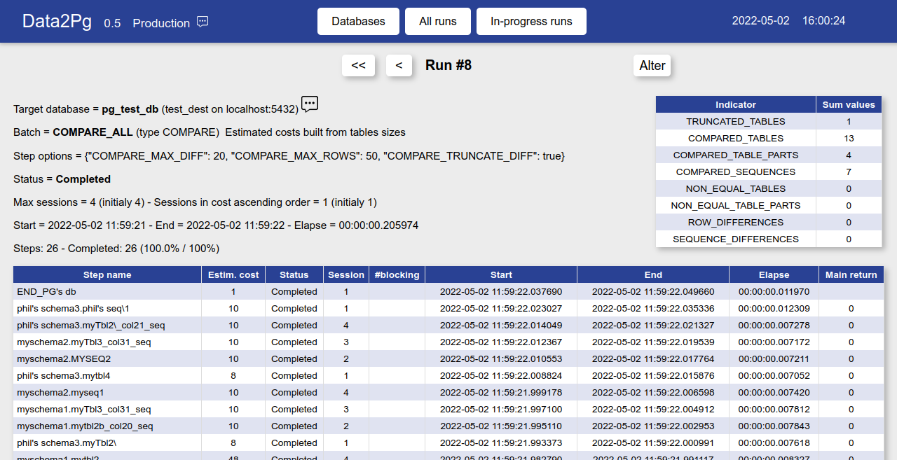

# How to monitor runs

There are two ways to monitor in-progress or completed batch runs: either using the web client interface or running the data2pg_monitor client in a terminal.

The shell command syntax can be displayed with the --help option.

```sh
perl data2pg_monitor.pl --help
data2pg_monitor.pl belongs to the data2pg project (version 0.5).
It monitors data migrations towards PostgreSQL performed by the data2pg scheduler.

Usage:
  data2pg_monitor.pl [OPTION]...

Options:
  --host      IP host of the data2pg database (default = PGHOST env. var.)
  --port      IP port of the data2pg database (default = PGPORT env. var.)
  --lines     maximum number of lines to display (0 = default = no page size limit)
  --run       optional run id to examine. If no specific run is specified, display the latest runs
                registered into the data2pg database
  --delay     delay in seconds between 2 displays of details for a specific 'Initializing',
                'In_progress' or 'Ending' run (default = 5)
  --help      shows this help, then exit
  --version   outputs version information, then exit

Examples:
  data2pg_monitor.pl --host localhost --port 5432 --lines 40 --delay 10
              displays the list of the latest registered run, with no more than 40 generated lines
  data2pg_monitor.pl --host localhost --port 5432 --lines 40 --run 58 --delay 10
              monitors the run #58 and refresh the screen every 10 seconds
```

The details of a completed batch of type COMPARE looks like:

```
data2pg_monitor (version 0.5)          Run: 8          02/05/2022 - 16:13:31
Database: pg_test_db    Batch: COMPARE_ALL    Type: COMPARE    Sessions: 4    Step options: {"COMPARE_MAX_DIFF": 20, "COMPARE_MAX_ROWS": 50, "COMPARE_TRUNCATE_DIFF": true}
Status: 'Completed'    Start: 2022-05-02 11:59:21   End:2022-05-02 11:59:22   Elapse: 00:00:00           
Steps Total: 26  Completed: 26 (100%/100%)
        'Completed' steps                     Estim.Cost Sess.       Start               End             Elapse      Main indicator
END_PG's db                                            1   1 2022-05-02 11:59:22 2022-05-02 11:59:22 00:00:00.011970
phil's schema3.phil's seq\1                           10   1 2022-05-02 11:59:22 2022-05-02 11:59:22 00:00:00.012309              0
phil's schema3.myTbl2\_col21_seq                      10   4 2022-05-02 11:59:22 2022-05-02 11:59:22 00:00:00.007278              0
myschema2.myTbl3_col31_seq                            10   3 2022-05-02 11:59:22 2022-05-02 11:59:22 00:00:00.007172              0
myschema2.MYSEQ2                                      10   2 2022-05-02 11:59:22 2022-05-02 11:59:22 00:00:00.007211              0
phil's schema3.mytbl4                                  8   1 2022-05-02 11:59:22 2022-05-02 11:59:22 00:00:00.007052              0
myschema2.myseq1                                      10   4 2022-05-02 11:59:21 2022-05-02 11:59:22 00:00:00.007420              0
myschema1.myTbl3_col31_seq                            10   3 2022-05-02 11:59:21 2022-05-02 11:59:22 00:00:00.007812              0
myschema1.mytbl2b_col20_seq                           10   2 2022-05-02 11:59:21 2022-05-02 11:59:22 00:00:00.007843              0
phil's schema3.myTbl2\                                 8   1 2022-05-02 11:59:21 2022-05-02 11:59:22 00:00:00.007618              0
myschema1.mytbl2                                      48   4 2022-05-02 11:59:21 2022-05-02 11:59:21 00:00:00.008327              0
myschema1.mytbl2b                                     56   3 2022-05-02 11:59:21 2022-05-02 11:59:21 00:00:00.008158              0
myschema2.mytbl2                                      72   2 2022-05-02 11:59:21 2022-05-02 11:59:21 00:00:00.008715              0
myschema2.mytbl8                                       8   1 2022-05-02 11:59:21 2022-05-02 11:59:21 00:00:00.008269              0
myschema2.mytbl7                                     360   4 2022-05-02 11:59:21 2022-05-02 11:59:21 00:00:00.008644              0
myschema2.myTbl3                                     512   3 2022-05-02 11:59:21 2022-05-02 11:59:21 00:00:00.009253              0
myschema1.mytbl1                                     512   2 2022-05-02 11:59:21 2022-05-02 11:59:21 00:00:00.009369              0
myschema1.MYTBL4                                       8   1 2022-05-02 11:59:21 2022-05-02 11:59:21 00:00:00.008797              0
phil's schema3.phil's tbl1                          1584   3 2022-05-02 11:59:21 2022-05-02 11:59:21 00:00:00.017272              0
myschema2.mytbl1.4                                  5608   2 2022-05-02 11:59:21 2022-05-02 11:59:21 00:00:00.017140              0
myschema1.myTbl3                                       8   1 2022-05-02 11:59:21 2022-05-02 11:59:21 00:00:00.016512              0
myschema2.mytbl1.3                                  5608   4 2022-05-02 11:59:21 2022-05-02 11:59:21 00:00:00.043789              0
myschema2.mytbl1.2                                  5608   3 2022-05-02 11:59:21 2022-05-02 11:59:21 00:00:00.030239              0
myschema2.mytbl1.1                                  5608   2 2022-05-02 11:59:21 2022-05-02 11:59:21 00:00:00.040115              0
myschema2.mytbl4                                       0   1 2022-05-02 11:59:21 2022-05-02 11:59:21 00:00:00.039565              0
INIT_PG's db                                           1   1 2022-05-02 11:59:21 2022-05-02 11:59:21 00:00:00.013634
```

For the same batch run, the web client run details page looks like


