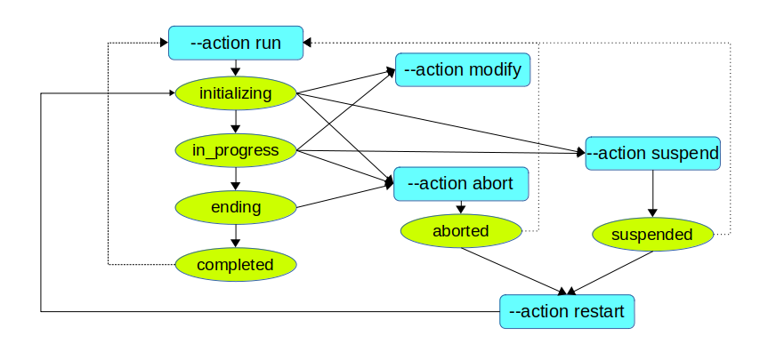

# How to start the scheduler

## Running a batch

There are two ways to start the scheduler: either using the web client interface or typing a shell command in a terminal.

The web client batch run form looks like


The shell command syntax can be displayed with the --help option.

```sh
perl data2pg.pl --help

 Data2Pg - version 0.7
-----------------------
Data2Pg is a migration framework to load PostgreSQL databases.
Usage: data2pg.pl [--help] | [<options to log on the data2pg>] --action <action> [--conf <configuration_file>] [<other options>]]

  --host         : IP host of the data2pg administration database (default = PGHOST env. var.)
  --port         : IP port of the data2pg administration database (default = PGPORT env. var.)
  --dbname       : administration database name (default = data2pg)
  --user         : role to log on the administration database (default = data2pg)
  --action       : 'run' | 'restart' | 'suspend' | 'abort' | 'check' (no default)
  --conf         : configuration file (default = no configuration file)
  --verbose      : display additional information during the run
  --target       : target database identifier (mandatory) (*)
  --batch        : batch name for the run (mandatory, except for the 'check' action) (*)
  --step_options : JSON formatted list of options sent to each step (*)
  --sessions     : number of parallel sessions (default = 1) (*)
  --asc_sessions : number of sessions for which steps will be assigned in estimated cost ascending order (default = 0) (*)
  --comment      : comment describing the run (between single or double quotes to include spaces) (*)
  --ref_run      : id of a run used as a reference for the steps duration, instead of tables size (default = no reference run) (*)
  --run          : run_id supplied by external tools (should not be used for manual run start)
(*) the option may also be set in the configuration file. The command line parameters overide the configuration file content, if any
```

## The scheduler configuration file

Most parameters of the command line can be stored into a scheduler configuration file. In this file:

   * the '#' character starts a comment
   * a parameter if formated as : keyword = value

The following parameters are available:

```
# Identifier of the target database to migrate (mandatory)
TARGET_DATABASE    = <target_db>            # case sensitive, must match the target_database table content in the data2pg database

# Identifier of the batch (mandatory)
BATCH_NAME         = <batch_name>           # case sensitive, must match the migration configuration in the target database

# The maximum number of opened sessions on the target database. This defines the parallelism degree for the run.
MAX_SESSIONS       = <ss>                   # Default = 1

# Among the opened sessions, number of sessions for which the steps will be assigned in estimated cost ascending order.
ASC_SESSIONS       = <a>                    # Default = 0

# Run id whose step durations are used as step estimated costs instead of table size.
REFERENCE_RUN      = <rrr>                  # Default = no reference run

# Step options, in JSON format. They are forwarded to each elementary step of the batch to adjust their behaviour.
STEP_OPTIONS = {<json_formatted_options>}   # Default = no step option
```

## The step options

The migration configuration describes most technical details of the operations. But some options are also available at execution time. They depend on the batch type. When the scheduler is spawned in command line, these options can be set through either the parameters file read by the scheduler, if any, or directly in the --step_options parameter. In both cases, the set of options is formatted as a JSON structure.

For batches of type COPY, the following step options are available:

   * COPY_MAX_ROWS to limit the number of copied rows per table or table part, based on a fixed value;
   * COPY_PCT_ROWS to limit the number of copied rows per table or table part, based on a % of rows (computed from the source database statistics).

For batches of type DISCOVER, the following step options are available:

   * DISCOVER_MAX_ROWS to limit the number of analyzed rows per table, based on a fixed value;

For batches of type COMPARE, the following step options are available:

   * COMPARE_TRUNCATE_DIFF to truncate the content_diff table that collects the reported differences (boolean, 'false' by default);
   * COMPARE_MAX_DIFF to limit the number of differences per table reported by a batch of type COMPARE (no limit by default);
   * COMPARE_MAX_ROWS to limit the number of compared rows for a table.

Examples:

   * In a COPY batch parameter file, we could find a line:
```
STEP_OPTIONS = {"COPY_MAX_ROWS":10000}
```

   * In the scheduler spawn command line for a COMPARE batch, we could find the parameter:
```
 --step_options "{"COMPARE_TRUNCATE_DIFF":true, "COMPARE_MAX_DIFF":20}"
```

## Managing runs

Once a batch run is spawned by a `perl data2pg.pl --action run ...` command, it is possible to:

   * dynamicaly change the number of sessions;
   * suspend its execution;
   * abort its execution;
   * restart an aborted or suspended batch run.

This chart shows the actions that can be performed on a batch run and its possible states.



All these actions can be performed easily with the web client. The paragraphs below explain how to proceed in command line terminal.

### Change the number of sessions

There is no command to dynamically change the number of sessions of a running batch. But this can be achieved using a SQL statement. Once connected to the administration database, execute the following statement:

```
SET search_path = \<data2pg_admin installation schema\>;
UPDATE run SET run_max_sessions = s, run_asc_sessions = a WHERE run_id = iii;
```

Where:

  * s is the requested maximum number of sessions;
  * a is the requested number of sessions with steps allocated in ascending cost order (with a <= s);
  * iii is the run identifier.

The scheduler reads this table every 30 seconds and adjusts the number of opened sessions if needed. If new sessions are requested, they are opened immediately. If the new maximum number of sessions is lower than the previous one, exceeding sessions will be closed once their current step is completed.

Note that setting the maximum number of sessions to 0 is equivalent to suspend the run.

### Suspend a batch execution

To suspend a running batch, just type the following command:

```sh
perl data2pg.pl --action suspend ...
```

The same options as for the run command must be used, so that the batch can be identified.

The scheduler will let the in-progress steps complete their task before stopping the run.

Once the run is suspended, it is possible to restart it.

### Abort a batch execution

To abort a running batch, just type the following command:

```sh
perl data2pg.pl --action abort ...
```

The same options as for the run command must be used, so that the batch can be identified.

All in-progress steps are immediately cancelled and their transactions are rolledback.

Note that a batch run that has unexpectedly aborted must be "officialy" aborted by a `perl data2pg.pl --action abort ...` command before any rerun or restart attempt. This is a protection against several simultaneous executions of the same batch.

### Restart a batch execution

To restart a batch that has been previously either suspended or aborted, just type the following command:

```sh
perl data2pg.pl --action restart ...
```

The same options as for the run command must be used.

When a batch run is restarted, a new run is spawned with a new identifier. It uses the same working plan and considers all properly terminated steps of the previous run as already completed.

A batch can be suspended/aborted and restarted several times.

## Run report

When a batch run is completed, the scheduler generates a synthetic report that looks like:

```
================================================================================
The run #6 is completed.
Target database           : pg_test_db
Batch                     : BATCH1 (type COPY)
Step options              : none
Run elapse time           : 00:00:00.638102
Number of processed steps : 44
Aggregated indicators
     COPIED_TABLES        : 16
     COPIED_ROWS          : 126011
     INVALIDATED_INDEXES  : 9
     REBUILT_INDEXES      : 10
     COPIED_SEQUENCES     : 7
     CHECKED_FKEYS        : 4
     CHECKED_TABLES       : 9
     COMPUTED_AGGREGATES  : 9
     UNEQUAL_AGGREGATES   : 0
     DO_NOTHING_OK        : 1
     FINAL_CHECKS_OK      : 1
The operation details are available in the data2pg administration database.
================================================================================
```
The reported indicators depend on the executed action types. Checking them is important because they may report troubles encountered in the batch run. For instance, UNEQUAL_AGGREGATES should always be 0, when present.
